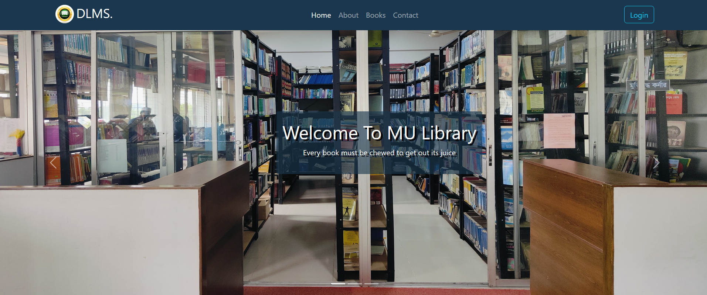
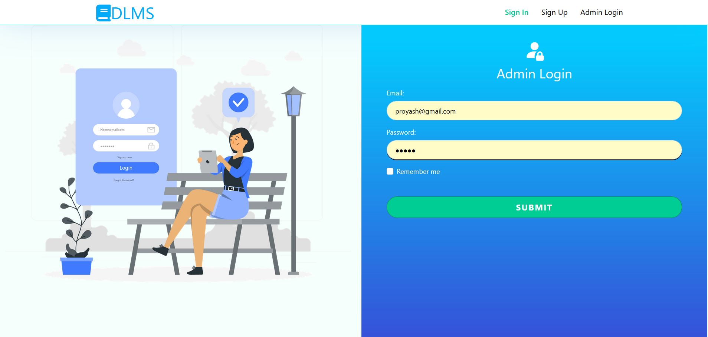
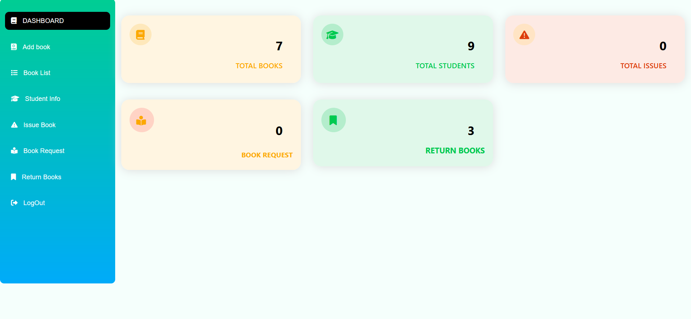
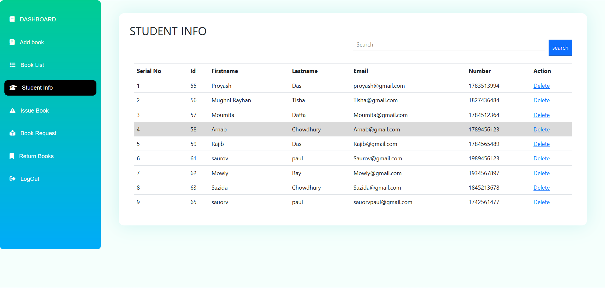
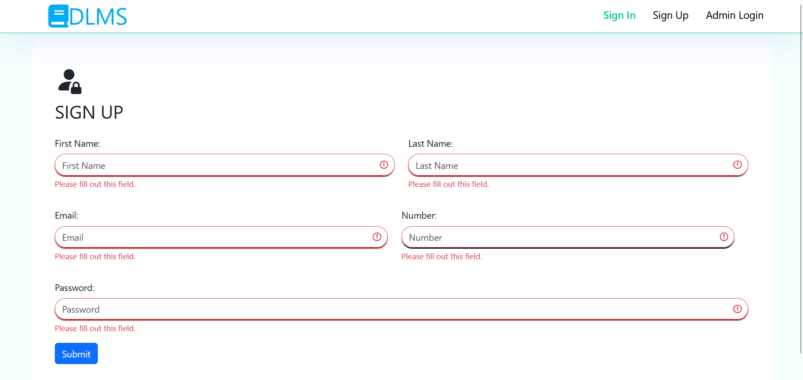
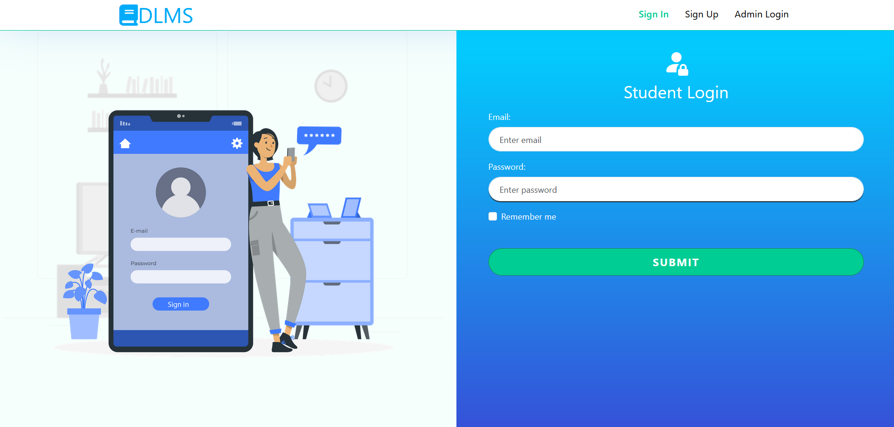
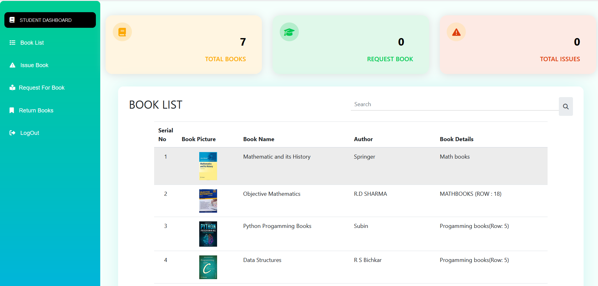
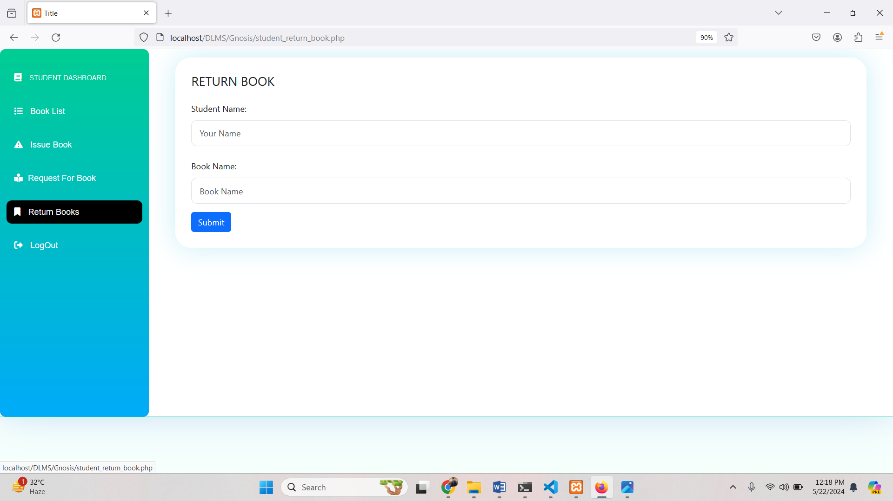
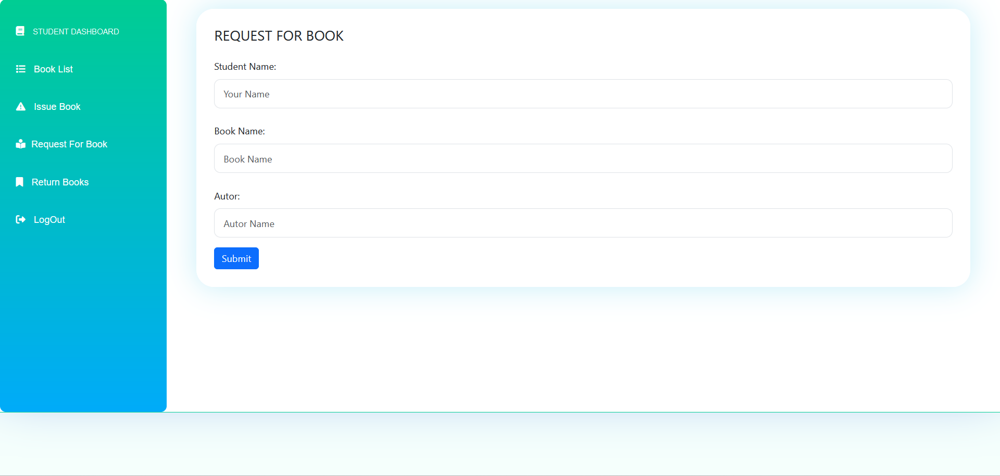

<h1>DIGITAL LIBRARY MANAGEMENT SYSTEM.</h1>

Digital Library Management System using PHP & MySql

<h2>Requirements.</h2>
<ul>
  <li>XAMPP Server</li>
  <li>Browser (Chrome,Mozilla)</li>
  <li>Code Editor (Vim, Sublime Text, VSCode)</li>
</ul>

<!-- Fetures VISITORS -->

<h2>Fetures VISITORS</h2>

  
   
   
   
  
  
  

<!-- Admin fetures -->
<h2>Features ADMIN</h2>
<ul>
  <li>ADMIN Login.</li>
  <li>Add/Delete Books.</li>
  <li>Add/Delete/Update Gallery Photos</li>
  <li>Delete Students</li>
  <li>Add/Delete Student Information</li>
  <li>Check Return Books</li>
  <li>Add/Delete Book Request</li>
  <li>Logout</li>
</ul>

  
   
   

<!-- Students Features -->
<h2>Features STUDENTS</h2>
<ul>
  <li>Students Sign up & Login. </li>
  <li>Request Books</li>
  <li>Add Books</li>
  <li>Return Books</li>
  <li>Issue Books</li>
  <li>Logout </li>
</ul>

  
  
  
  
  

<h1>How to Setup</h1>
<ul>
  <li>Install XAMPP Server</li>
  <li>Start Apache and MySQL</li>
  <li>Copy the this folder "DLMS to C:\xampp\htdocs</li>
  <li>Open browser and type http://localhost/DLMS</li>
  <li>Create a new Databse with name "sql"</li>
  <li>Import the sql file from the database folder in DLMS.</li>
  <li>
To open the file in browser type http://localhost/DLMS/index.php</li>
</ul>

<h1>Thanks</h1>
